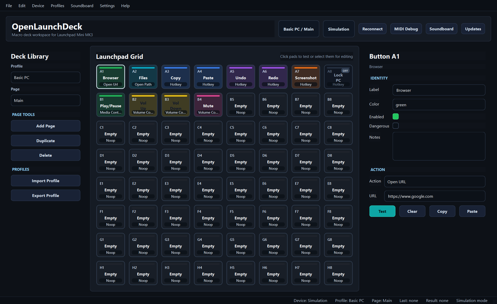
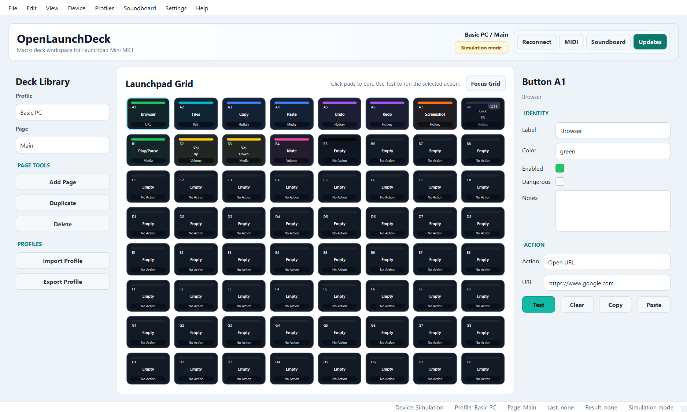

<p align="center">
  
</p>

<h1 align="center">OpenLaunchDeck</h1>

<p align="center">
  <strong>Turn a Novation Launchpad Mini MK3 into a 64-pad Windows macro deck for OBS, soundboard clips, voice chat, hotkeys, games, and everyday automation.</strong>
</p>

<p align="center">
  <a href="https://github.com/Riqqqque/OpenLaunchDeck/releases/latest">Download latest release</a>
  |
  <a href="https://github.com/Riqqqque/OpenLaunchDeck/wiki">User wiki</a>
  |
  <a href="docs/wiki/Quick-Start.md">Quick start</a>
  |
  <a href="docs/wiki/Button-Recipes.md">Button recipes</a>
</p>

OpenLaunchDeck turns the 8x8 RGB pad grid on a Novation Launchpad Mini MK3 into a Stream Deck-style control surface for Windows. It is built for streamers, gamers, and desk setups that need lots of buttons without buying a separate dedicated macro deck.

It is a normal desktop app: install it, launch it, assign actions, keep it running in the background, and store user data in AppData so upgrades do not overwrite profiles or settings.

## Why It Exists

The Launchpad Mini MK3 is compact, widely available, and already has 64 RGB pads. OpenLaunchDeck makes that hardware useful outside music software:

- Trigger OBS replay buffer clips, screenshots, source visibility, scene changes, and mute controls
- Play soundboard clips locally and route selected clips into Discord or in-game voice chat
- Use F13-F24 and normal hotkeys for game-safe shortcuts
- Build pages of macros with colors, labels, dangerous-action confirmation, and profile backups
- Configure everything without hardware connected, then plug in the Launchpad when it arrives

## Supported Hardware

- Novation Launchpad Mini MK3
- USB MIDI input for pad presses
- USB MIDI output for pad lighting
- Simulation mode when no Launchpad is connected

Programmer Mode is recommended for predictable pad messages. Device mode can affect note/control mappings, so OpenLaunchDeck includes MIDI Debug and calibration tools instead of spreading note numbers through the app.

## Screenshots





More screenshots are tracked in [docs/screenshots](docs/screenshots).

## Setup Guides

The beginner-friendly [GitHub Wiki](https://github.com/Riqqqque/OpenLaunchDeck/wiki) is the best place to start. It covers the full setup path without assuming you already know MIDI, OBS WebSocket, or Windows audio routing.

- [Quick Start](https://github.com/Riqqqque/OpenLaunchDeck/wiki/Quick-Start)
- [Launchpad Mini MK3 Setup](https://github.com/Riqqqque/OpenLaunchDeck/wiki/Launchpad-Mini-MK3-Setup)
- [Button Recipes](https://github.com/Riqqqque/OpenLaunchDeck/wiki/Button-Recipes)
- [OBS WebSocket Setup](https://github.com/Riqqqque/OpenLaunchDeck/wiki/OBS-WebSocket-Setup)
- [Soundboard and Voice Chat Routing](https://github.com/Riqqqque/OpenLaunchDeck/wiki/Soundboard-and-Discord-Routing)
- [Performance and Gaming](https://github.com/Riqqqque/OpenLaunchDeck/wiki/Performance-And-Gaming)

## Features

- Editable 8x8 Launchpad-style grid
- Modern dark/light desktop UI with configurable grid density
- Multiple profiles and pages
- Simulation testing without hardware through the button editor
- MIDI input/output structure for Launchpad Mini MK3
- Isolated A1-H8 MIDI mapping with calibration
- Page lighting refresh with changed-pad batching
- Button editor with action-specific settings
- URL actions with optional private-window mode
- Dangerous action double-press confirmation
- Soundboard playback with stop controls
- Soundboard output selectors that hide duplicate Windows device names
- Microphone routing into the selected soundboard voice route
- OpenLaunchDeck Audio Bridge detection for a built-in voice route endpoint pair
- Background action execution
- Coalesced RGB output and a shared lighting timer to avoid thread churn during rapid presses
- Queued file logging and debounced profile autosaves
- Manual update checks with SHA256 verification
- Launch at startup using the current Windows user startup entry
- Optional startup update checks
- Logs, diagnostics, settings, backups, profiles, MIDI mappings, and update downloads in AppData
- Starter profiles for PC shortcuts, streaming, Discord audio, and soundboard workflows
- Optional native helper for focused mapping/hash/checksum utilities

## Installation

Download the latest installer from the releases page when available and run it.

User data is stored in:

```text
%APPDATA%\OpenLaunchDeck
```

Installer upgrades replace program files only. Profiles, settings, logs, backups, MIDI mappings, imported assets, and update downloads stay in AppData.

## Updating

Open `Help > Check for Updates` to check the latest checksum-backed GitHub release. Startup checks are optional and run in the background. Advanced deployments can override this with a custom update manifest URL in Settings.

The updater can:

- Read the installer and checksum assets from the latest GitHub release, or fetch a custom JSON manifest with a timeout
- Compare semantic versions
- Detect required updates and unsupported current versions
- Download installers to `%APPDATA%\OpenLaunchDeck\updates`
- Verify SHA256 before allowing installer launch
- Keep the current app running when download or checksum verification fails
- Back up profile JSON files before launching a verified installer when automatic backups are enabled

OpenLaunchDeck does not install updates silently. Portable/source runs may need a manual update after the verified installer is downloaded.

See [docs/updating.md](docs/updating.md) for the manifest format and local update testing.

## Launch At Startup

Enable `Settings > Launch at startup` to start OpenLaunchDeck when you sign in to Windows. The setting writes a current-user startup entry, so it does not require administrator rights.

The installed startup entry uses background mode so Windows sign-in does not fight with window-layout tools. `Start minimized` still controls normal app launches. If the microphone voice route is enabled, OpenLaunchDeck keeps running in the tray when the window is closed so Discord or game chat does not receive silence. Use `File > Quit` or the tray `Quit` action when you intentionally want to stop the route.

If another Windows cleanup or startup manager removes the entry, launch OpenLaunchDeck once and open Settings to re-enable `Launch at startup`. The installed app repairs stale startup paths when it runs.

OpenLaunchDeck is single-instance. If Windows Startup, a macro helper, or a window-layout tool launches it while it is already running, the new launch hands off to the existing app and exits.

External startup tools can use these optional launch flags:

```powershell
OpenLaunchDeck.exe --show
OpenLaunchDeck.exe --background
```

Use `--show` or `--focus` when the tool should bring the existing window forward for positioning. Use `--background` or `--start-minimized` when the tool only needs to make sure OpenLaunchDeck is running.

## Running From Source

```powershell
python -m venv .venv
.venv\Scripts\activate
pip install -r requirements.txt
python -m openlaunchdeck.main
```

For hardware MIDI testing from source, Python 3.11-3.13 is currently the safest Windows path because the real-time MIDI backend has prebuilt wheels there. Newer Python versions can still run simulation mode and tests, but MIDI hardware support may need a local C++ toolchain.

## Running Tests

Tests do not require Launchpad hardware.

```powershell
pytest
```

## Building The EXE

```powershell
powershell -ExecutionPolicy Bypass -File build.ps1 -SkipInstaller
```

The build script creates `.venv` if needed, installs requirements, runs tests, and builds `dist\OpenLaunchDeck\OpenLaunchDeck.exe` with PyInstaller.
It also writes `dist\OpenLaunchDeck-<version>-Windows.zip` and a `.sha256` checksum file for portable testing.

For repeat local packaging after tests have already passed, use:

```powershell
powershell -ExecutionPolicy Bypass -File build.ps1 -SkipInstaller -SkipTests -FastPackage
```

## Creating The Installer

Install Inno Setup, then run:

```powershell
powershell -ExecutionPolicy Bypass -File build.ps1
```

When Inno Setup is available, the script builds `dist\installer\OpenLaunchDeckSetup-<version>.exe` and writes a `.sha256` file beside it. The version comes from `openlaunchdeck/version.py`.

## Publishing A Release

Every tagged release should publish ready-to-download Windows packages. Push a `v<version>` tag after the version bump is committed:

```powershell
git tag v<version>
git push origin v<version>
```

The Release workflow builds and uploads the installer EXE, portable ZIP, and SHA256 checksum files to GitHub Releases. It uses the same build script with CI-specific fast packaging flags so tagged releases spend less time on packaging.

## First Setup

On first launch, choose a starter profile or start with a blank deck. If no Launchpad is connected, OpenLaunchDeck stays in simulation mode. Click grid pads to edit them, then use the selected button's Test control when you want to run an action from the app.

When the Launchpad is connected:

1. Put the device in Programmer Mode.
2. Open `Device > MIDI Debug`.
3. Confirm input and output ports are detected. On Windows, the Launchpad Mini MK3 can appear as `LPMiniMK3 MIDI`, `MIDIIN2 (LPMiniMK3 MIDI)`, and `MIDIOUT2 (LPMiniMK3 MIDI)`. OpenLaunchDeck prefers the second MIDI interface for macro control.
4. Press pads and watch raw MIDI messages.
5. Use calibration if parsed button IDs do not match A1-H8.
6. Save the mapping and reconnect.

The Launchpad Mini MK3 has extra navigation and scene-launch buttons around the 8x8 grid. The current OpenLaunchDeck mapping treats the 8x8 grid as the reliable macro surface. To change OpenLaunchDeck pages today, assign a grid pad to the Switch Page action. Extra hardware buttons can be inspected in MIDI Debug, but they are not bound to previous/next OpenLaunchDeck pages by default until their messages are verified on hardware.

## MIDI Troubleshooting

Use `Device > MIDI Debug` when pads do not map or light correctly. The debug window shows available ports, raw incoming messages, outgoing lighting messages, parsed button IDs, and the current mapping table.

If OpenLaunchDeck shows Connected mode but physical pad presses do not trigger anything, press Reconnect. The app switches the device into Programmer Mode on connect and uses the Launchpad Mini MK3 MIDI interface rather than the DAW/session interface.

If the default mapping is wrong for your device mode, run calibration. Saved mappings live in:

```text
%APPDATA%\OpenLaunchDeck\midi_mappings
```

See [docs/hardware_notes.md](docs/hardware_notes.md) and [docs/midi_mapping.md](docs/midi_mapping.md).

## Soundboard Setup

Soundboard buttons can play local `.wav`, `.mp3`, and platform-supported `.ogg` files through QtMultimedia. Each button supports volume, looping, voice-chat routing, already-playing behavior, active color, and stop behavior. Per-button and global soundboard volume use the same effective gain for local monitoring and routed voice-chat playback.

OpenLaunchDeck handles routed sound playback and microphone routing itself: a routed clip can play to the voice route and to your normal output at the same time, and the selected microphone can be mixed into that route. The Soundboard panel can auto-detect a ready route and show the exact voice chat input device to select. Discord, in-game voice chat, and other apps can use that input when they are configured to listen to the route.

When microphone routing is enabled, OpenLaunchDeck watches the route and restarts it if the bridge is not running. Closing the main window keeps the app alive in the tray so the voice route stays active.

The planned OpenLaunchDeck Audio Bridge provides a dedicated Windows endpoint pair named `OpenLaunchDeck Voice Output` and `OpenLaunchDeck Voice Input`. The app already detects and prefers that pair when it exists. The bridge driver must be built and signed separately before Windows will load it.

See [docs/soundboard_setup.md](docs/soundboard_setup.md), [docs/discord_voice_routing.md](docs/discord_voice_routing.md), and [docs/audio_bridge.md](docs/audio_bridge.md).

## Performance Notes

OpenLaunchDeck keeps expensive work away from the GUI thread:

- MIDI callbacks parse and emit lightweight events
- Blocking actions run through a bounded worker pool
- Update checks and downloads run on Qt worker threads
- Sound playback uses non-blocking QtMultimedia APIs
- Hotkeys use a Windows native keyboard path first, with Python automation as a fallback
- Lighting refreshes skip unchanged pad colors and send MIDI output on a background worker
- Grid cells skip redundant text/style updates
- MIDI Debug UI updates stay off unless the debug window is open
- The Windows process stays at Normal priority so games keep scheduler priority
- Hidden or minimized windows skip unnecessary grid/status repaints
- Performance logging is quiet by default and can be enabled in Settings

See [docs/performance.md](docs/performance.md).

## Optional Native Acceleration

The app runs fully in Python by default. The optional Rust helper uses PyO3/maturin for focused utilities:

- Button ID validation and conversion
- Profile text hashing
- SHA256 verification

If the helper is missing, disabled, or cannot be imported, OpenLaunchDeck uses Python fallbacks.

Build without native acceleration:

```powershell
powershell -ExecutionPolicy Bypass -File build.ps1
```

Build and install the optional helper into the local virtual environment:

```powershell
powershell -ExecutionPolicy Bypass -File build.ps1 -BuildNative
```

## Profile Format

Profiles are human-readable JSON files stored in:

```text
%APPDATA%\OpenLaunchDeck\profiles
```

Minimal example:

```json
{
  "name": "Basic PC",
  "id": "basic_pc",
  "default_page": "main",
  "pages": [
    {
      "name": "Main",
      "id": "main",
      "buttons": {
        "A1": {
          "label": "Browser",
          "color": "green",
          "enabled": true,
          "dangerous": false,
          "action": {
            "type": "open_url",
            "config": {
              "url": "https://www.google.com",
              "private_window": false
            }
          }
        }
      }
    }
  ]
}
```

See [docs/profile_format.md](docs/profile_format.md).

## Adding Custom Actions

Actions live in `openlaunchdeck/actions/`. Add a class derived from `BaseAction`, define `type_name`, `display_name`, `config_fields`, and `execute()`, then register it in `actions/registry.py`.

Return clear `ActionResult` values so the GUI, logs, and Launchpad feedback can show useful status.

## Roadmap

- Hardware-verified Launchpad Mini MK3 mapping and lighting presets
- More OBS WebSocket operations and friendlier setup helpers
- Secure SSH secrets flow
- More advanced audio output routing
- Richer first-run wizard and tray polish
- Signed installer
- Update manifest publishing automation

## Known Limitations

- OBS WebSocket actions require the OBS WebSocket server to be enabled. If authentication is enabled in OBS, set the button password field to the OBS WebSocket password.
- OBS passwords are masked in the editor but remain part of the local profile JSON so actions can reconnect. Treat exported profiles as sensitive when they contain a password.
- SSH command support depends on Paramiko and key-based authentication setup.
- Volume actions control the default Windows playback endpoint. App-specific mixer sliders are handled by Windows and virtual audio tools.
- Launchpad mappings should be verified in MIDI Debug before relying on them live.
- The default lighting palette is a Programmer Mode preset and needs hardware verification for each target mode.
- Startup update checks are intentionally quiet; manual checks show full detail.

## Contributing

See [CONTRIBUTING.md](CONTRIBUTING.md).

## License

MIT. See [LICENSE](LICENSE).
