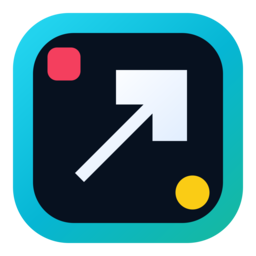
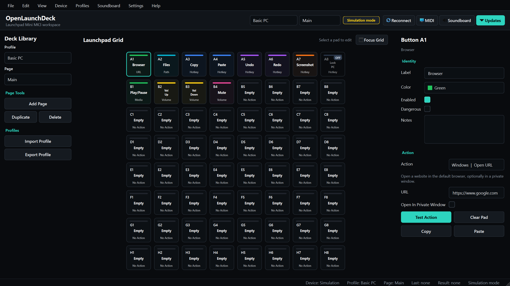
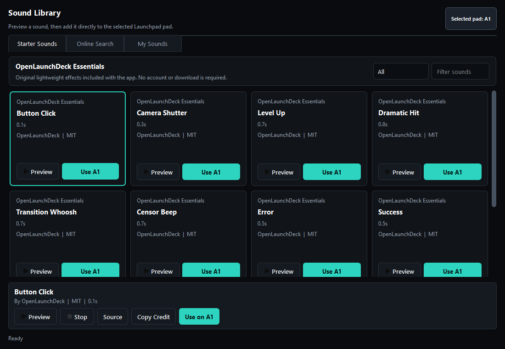

<p align="center">
  
</p>

<h1 align="center">OpenLaunchDeck</h1>

<p align="center">
  Turn a Novation Launchpad Mini MK3 into a 64-pad Windows macro deck for streaming, gaming, soundboards, and everyday shortcuts.
</p>

<p align="center">
  <a href="https://github.com/Riqqqque/OpenLaunchDeck/actions/workflows/ci.yml"></a>
  <a href="https://github.com/Riqqqque/OpenLaunchDeck/releases/latest"></a>
  <a href="LICENSE"></a>
  
</p>

<p align="center">
  <a href="https://github.com/Riqqqque/OpenLaunchDeck/releases/latest"><strong>Download</strong></a>
  &nbsp;|&nbsp;
  <a href="https://github.com/Riqqqque/OpenLaunchDeck/wiki/Quick-Start">Quick Start</a>
  &nbsp;|&nbsp;
  <a href="https://github.com/Riqqqque/OpenLaunchDeck/wiki">Wiki</a>
  &nbsp;|&nbsp;
  <a href="https://github.com/Riqqqque/OpenLaunchDeck/wiki/Troubleshooting">Troubleshooting</a>
</p>

OpenLaunchDeck is an installable PySide6 desktop app for the **Novation Launchpad Mini MK3**. It listens for USB MIDI pad presses, runs the action assigned to each pad, and keeps the 8x8 RGB grid synchronized with the active profile and page.

No Launchpad yet? The full editor works in Simulation mode, so profiles can be built and tested before the hardware is connected.



## What You Can Do

| Area | Examples |
| --- | --- |
| OBS | Save replay-buffer clips, take screenshots, switch scenes, show or hide sources, mute inputs, start or stop recording |
| Soundboard | Use included original effects, import local files, or search public sounds; preview and assign in one click, then control looping, overlap, volume, and stopping |
| Voice chat | Send selected clips to a configured Windows voice route while monitoring them locally |
| Hotkeys | Build shortcuts with modifier controls and a searchable key list covering navigation, media keys, and `F1` through `F24` |
| Windows | Open websites, apps, folders, files, commands, PowerShell, and typed text |
| Automation | Send HTTP requests, run key-based SSH commands, and combine actions with delays |
| Deck organization | Create profiles, pages, labels, colors, page-switch buttons, and dangerous-action confirmations |

## Highlights

- Native Windows desktop application with a system tray
- Responsive 8x8 grid with square pads that stays readable in wide, compact, and single-pane windows
- Multiple profiles and pages with autosave and backups
- MIDI auto-detection, manual port selection, live debug logs, and pad calibration
- Batched RGB lighting with press, success, error, armed, and playing feedback
- Card-based Sound Library with an account-free starter collection, local imports, optional popular/new search, previews, license details, and one-click pad assignment
- Seven complete themes: Midnight, OLED Black, Galaxy OLED, Arctic White, Graphite, Broadcast, and High Contrast
- Searchable action picker, visible field guidance, color swatches, and a visual Multi-Action sequence editor
- Background action execution so commands and network requests do not block the interface
- Checksum-verified update downloads with user confirmation before installation
- User data stored outside the install folder in `%APPDATA%\OpenLaunchDeck`
- Optional native helper for focused mapping and checksum utilities; the app works without it

## Requirements

- Windows 11
- Novation Launchpad Mini MK3 for physical control
- USB MIDI connection
- Programmer Mode is recommended for predictable pad messages
- OBS Studio with its WebSocket server enabled for OBS actions
- A compatible Windows recording/output route for soundboard audio in voice chat

The Launchpad is optional for editing and testing. Tests and Simulation mode do not require hardware.

## Get Started

1. Download `OpenLaunchDeckSetup-<version>.exe` from the [latest release](https://github.com/Riqqqque/OpenLaunchDeck/releases/latest).
2. Install and open OpenLaunchDeck.
3. Pick a starter profile or start with a blank deck.
4. Click a grid pad to select it, then configure the button in the editor.
5. Use **Test Action** to run the selected action from the app.
6. Connect the Launchpad, press **Reconnect**, and verify the MIDI ports in **Device > MIDI Debug**.

Clicking a grid pad in the app selects it for editing. It does **not** run the assigned action. Actions run from the physical Launchpad or from **Test Action**.

Continue with the [beginner Quick Start](https://github.com/Riqqqque/OpenLaunchDeck/wiki/Quick-Start).

## Make It Yours

Open **Settings > Settings > Appearance** to choose a theme and pad density. The grid automatically keeps every pad square; at narrow widths, **Edit A1** opens the selected pad editor as a full-width view and **Back to Grid** returns to the deck.

Open **Soundboard > Browse Sound Library** for immediately usable original starter effects. Every sound card has **Preview** and **Use** controls. **My Sounds** accepts local WAV, MP3, and OGG files, while **Online Search** can be connected later when you want public popular or recent sounds.



## Guides

| Goal | Guide |
| --- | --- |
| Learn the interface | [Using the App](https://github.com/Riqqqque/OpenLaunchDeck/wiki/Using-The-App) |
| Connect and calibrate the Launchpad | [Launchpad Mini MK3 Setup](https://github.com/Riqqqque/OpenLaunchDeck/wiki/Launchpad-Mini-MK3-Setup) |
| See every available action | [Actions Reference](https://github.com/Riqqqque/OpenLaunchDeck/wiki/Actions-Reference) |
| Copy proven button configurations | [Button Recipes](https://github.com/Riqqqque/OpenLaunchDeck/wiki/Button-Recipes) |
| Configure OBS | [OBS WebSocket Setup](https://github.com/Riqqqque/OpenLaunchDeck/wiki/OBS-WebSocket-Setup) |
| Configure the soundboard | [Soundboard and Voice Chat](https://github.com/Riqqqque/OpenLaunchDeck/wiki/Soundboard-and-Discord-Routing) |
| Find and assign sound effects | [Sound Library](https://github.com/Riqqqque/OpenLaunchDeck/wiki/Sound-Library) |
| Find settings and data folders | [Settings and Data](https://github.com/Riqqqque/OpenLaunchDeck/wiki/Settings-And-Data) |
| Keep live controls safe | [Streaming Safety](https://github.com/Riqqqque/OpenLaunchDeck/wiki/Streaming-Safety) |
| Diagnose a problem | [Troubleshooting](https://github.com/Riqqqque/OpenLaunchDeck/wiki/Troubleshooting) |

## Installation And Updates

The installer places program files under Program Files. Profiles, settings, logs, backups, mappings, imported assets, and update downloads stay under:

```text
%APPDATA%\OpenLaunchDeck
```

Installer upgrades do not remove this folder. Open **Help > Check for Updates** for a manual update check. Update downloads are stored outside the install folder and must pass SHA256 verification before the installer can run. OpenLaunchDeck does not silently install updates.

See [Release and Update Flow](https://github.com/Riqqqque/OpenLaunchDeck/wiki/Release-and-Update-Flow) for the user and maintainer workflows.

## Running From Source

Python 3.11 through 3.13 is recommended for hardware MIDI development on Windows.

```powershell
python -m venv .venv
.venv\Scripts\activate
pip install -r requirements.txt
python -m openlaunchdeck.main
```

Run the tests:

```powershell
pytest
```

Build the portable application:

```powershell
powershell -ExecutionPolicy Bypass -File build.ps1 -SkipInstaller
```

Build the installer when Inno Setup is available:

```powershell
powershell -ExecutionPolicy Bypass -File build.ps1
```

The build creates versioned packages and SHA256 files under `dist`. See [CONTRIBUTING.md](CONTRIBUTING.md) and [docs/release_checklist.md](docs/release_checklist.md) before publishing a release.

## Current Limitations

- Launchpad mappings and lighting should be verified in MIDI Debug for the device mode in use.
- The extra Launchpad side and navigation buttons are not assigned to OpenLaunchDeck page changes by default. Use grid pads with the Switch Page action.
- Voice-chat routing needs a Windows audio route selected in both OpenLaunchDeck and the target chat application. No audio driver is bundled.
- Optional online Sound Library search requires a personal Freesound API key. Included starter sounds and local imports do not. Sound licenses and the provider's API terms still apply to public results; OpenLaunchDeck does not certify third-party uploads.
- OBS actions require OBS WebSocket. Passwords are masked in the editor but stored in local profile JSON, so exported profiles containing passwords are sensitive.
- SSH uses key-based authentication and rejects unknown host keys.
- The Windows installer is currently unsigned, so Windows may show a publisher warning.

## Contributing And Support

- Read [CONTRIBUTING.md](CONTRIBUTING.md) before opening a pull request.
- Use the [issue chooser](https://github.com/Riqqqque/OpenLaunchDeck/issues/new/choose) for reproducible bugs, feature requests, and hardware reports.
- Read [SUPPORT.md](SUPPORT.md) for the information that makes troubleshooting faster.
- Report sensitive problems through the process in [SECURITY.md](SECURITY.md), not a public issue.

## License

OpenLaunchDeck is available under the [MIT License](LICENSE).
